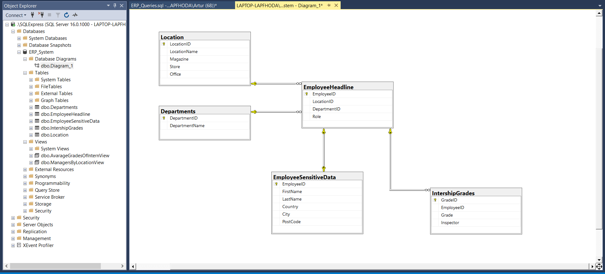
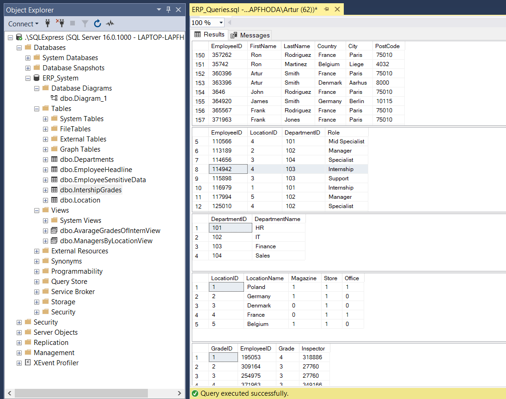
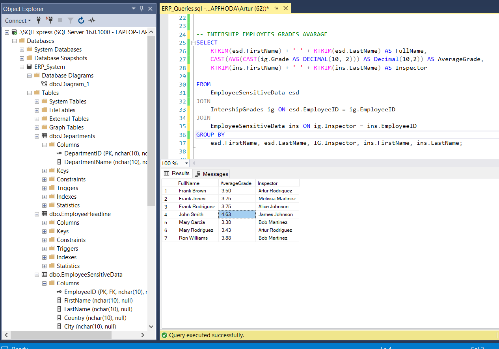
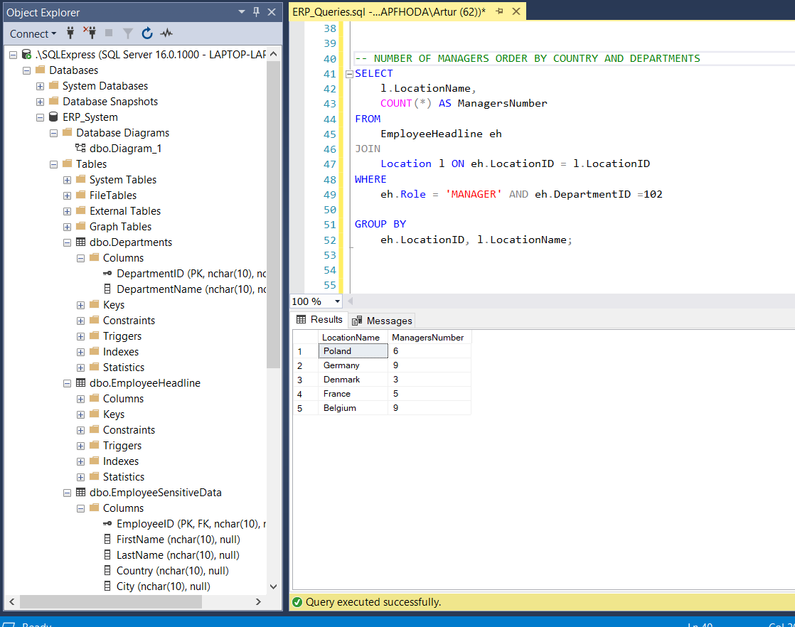
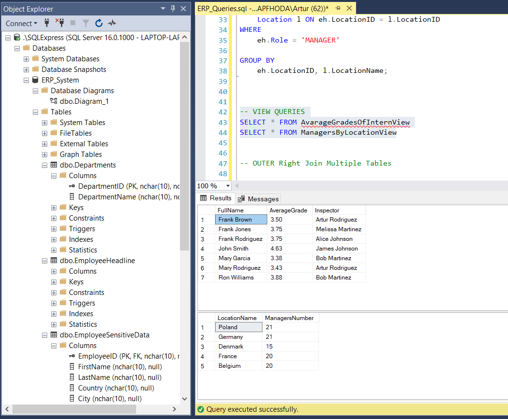
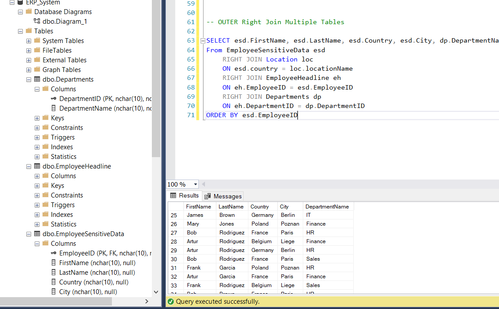

# MS_SQL
### Relational database containing various queries, views and relation keys 📁🌟 

* [Overview](#Relations-Diagram- 🔀) 
* [Queries](#Queries-🔢) 

 
## Relations Diagram  🔀
  
## Tables overview 🔢
  

## Queries ▶️

### Join 2 Tables and Group By - AVG Function ✨
<pre>
SELECT
    RTRIM(esd.FirstName) + ' ' + RTRIM(esd.LastName) AS FullName,
    CAST(AVG(CAST(ig.Grade AS DECIMAL(10, 2))) AS Decimal(10,2)) AS AverageGrade,
	RTRIM(ins.FirstName) + ' ' + RTRIM(ins.LastName) AS Inspector
	
FROM
    EmployeeSensitiveData esd
JOIN
    IntershipGrades ig ON esd.EmployeeID = ig.EmployeeID 
JOIN
    EmployeeSensitiveData ins ON ig.Inspector = ins.EmployeeID
GROUP BY
    esd.FirstName, esd.LastName, IG.Inspector, ins.FirstName, ins.LastName; 
</pre>
  

### Join, Count And Group By ✨
<pre>
SELECT
    l.LocationName,
    COUNT(*) AS ManagersNumber
FROM
    EmployeeHeadline eh
JOIN
    Location l ON eh.LocationID = l.LocationID
WHERE
    eh.Role = 'MANAGER' 

GROUP BY
    eh.LocationID, l.LocationName;
</pre>
  

### Views created from queries above ✨ 

  

### Outer JOIN multiple tables ✨
<pre>
SELECT esd.FirstName, esd.LastName, esd.Country, esd.City, dp.DepartmentName
  From EmployeeSensitiveData esd
  	RIGHT JOIN Location loc
  	ON esd.country = loc.locationName
	  RIGHT JOIN EmployeeHeadline eh
	  ON eh.EmployeeID = esd.EmployeeID
	  RIGHT JOIN Departments dp
	  ON eh.DepartmentID = dp.DepartmentID
  ORDER BY esd.EmployeeID
</pre>
  

### Foreign key set up ✨
<pre>
ALTER TABLE IntershipGrades
ADD CONSTRAINT FK_IntershipGradesInspectors
FOREIGN KEY (Inspector) 
REFERENCES EmployeeHeadline(EmployeeID); 
</pre>

### Simple AVG with 2 declimal points ✨
<pre>
SELECT CAST(AVG(CAST(Grade AS decimal(10,2))) AS DECIMAL(10,2)) AS average_grade
FROM IntershipGrades
GROUP BY EmployeeID
</pre>

### Remove spaces on right side ✨
<pre>
SELECT EMPLOYEEID, RTRIM(FirstName) + ' ' + RTRIM(LastName) AS FullName 
FROM EmployeeSensitiveData
</pre>
